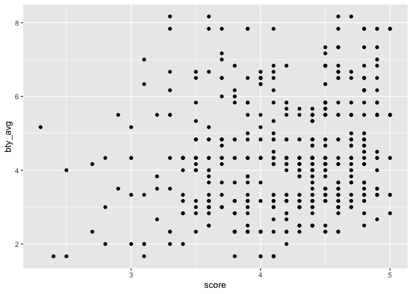
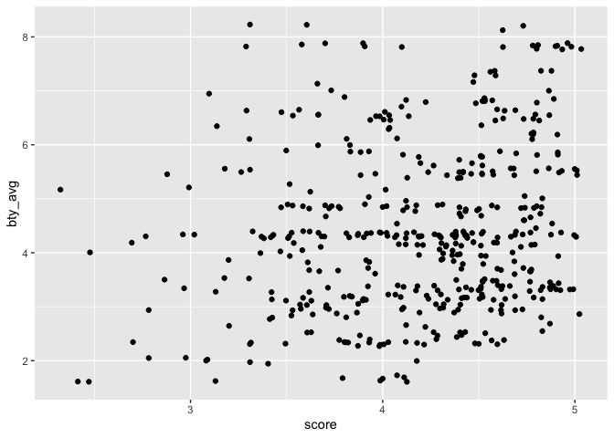
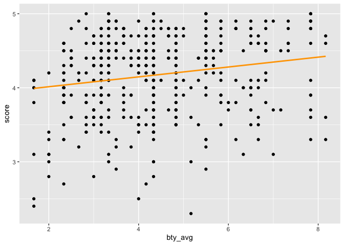

Lab 11 - Grading the professor, Pt. 2
================
Insert your name here
Insert date here

## Load packages and data

``` r
library(tidyverse) 
library(tidymodels)
library(openintro)
```

### Exercise 1

Students are pretty generous with their scores.

    ## `stat_bin()` using `bins = 30`. Pick better value `binwidth`.

<!-- -->

    ## [1] 2.3 3.8 4.3 4.6 5.0

    ## [1] 4.3

    ## [1] 4.17473

### Exercise 2

This graph shows a weak positive linear trend. Higher evaluation scores
are associated with higher beauty ratings but this relationship is weak.

<!-- -->

### Exercise 3

This helped separate overlapping points, however it still shows the same
relationship.

<!-- -->

### Part 2: Exercise 1

A one-point increase in beauty would predict a 0.07 increase in
evaluation score.

``` r
m_bty <- lm(score ~ bty_avg, evals)
summary(m_bty)
```

    ## 
    ## Call:
    ## lm(formula = score ~ bty_avg, data = evals)
    ## 
    ## Residuals:
    ##     Min      1Q  Median      3Q     Max 
    ## -1.9246 -0.3690  0.1420  0.3977  0.9309 
    ## 
    ## Coefficients:
    ##             Estimate Std. Error t value Pr(>|t|)    
    ## (Intercept)  3.88034    0.07614   50.96  < 2e-16 ***
    ## bty_avg      0.06664    0.01629    4.09 5.08e-05 ***
    ## ---
    ## Signif. codes:  0 '***' 0.001 '**' 0.01 '*' 0.05 '.' 0.1 ' ' 1
    ## 
    ## Residual standard error: 0.5348 on 461 degrees of freedom
    ## Multiple R-squared:  0.03502,    Adjusted R-squared:  0.03293 
    ## F-statistic: 16.73 on 1 and 461 DF,  p-value: 5.083e-05

### Exercise 2 & 3

Beauty appears to play a very minimal role in evaluations. The r-squared
is very small so there is a small correlation between beauty and
evaluation scores. Only about 4% of the variance in scores in explained
by variance. The uncertainty shown with the shading may give the false
narrative that the model fits better than it does.

    ## `geom_smooth()` using formula = 'y ~ x'

<!-- -->

### Part 3: Exercise 1

The reference level is male. The intercept tells you that the best
estimate of a female score is 4.09. Male professors are ranked about
0.14 points higher than female professors.The predicted mean evaluation
score for female professors is 4.09 and for males it is 4.23.

``` r
m_gen <- lm(score ~ gender, data = evals)
tidy(m_gen)
```

    ## # A tibble: 2 × 5
    ##   term        estimate std.error statistic p.value
    ##   <chr>          <dbl>     <dbl>     <dbl>   <dbl>
    ## 1 (Intercept)    4.09     0.0387    106.   0      
    ## 2 gendermale     0.142    0.0508      2.78 0.00558

### Part 3: Exercise 1

``` r
evals$rank_relevel <- relevel(evals$rank, ref = "tenure track")
library(dplyr)

evals <- evals %>%
  mutate(
    rank_relevel = relevel(factor(rank), ref = "tenure track"),
    tenure_eligible = ifelse(rank == "teaching", "no", "yes")
  )
```

### Exercise 2

The average score for teaching professors is 4.28. Tenure-track
professors score about 0.13 points lower than teaching profesors and
Tenured professors score about 0.15 points lower than teaching
professors in the first model.

In the second model, tenure track professors score 4.15 points on
average. Teaching professors score about 0.13 points higher and tenured
professors score about 0.02 points lower but this difference is not
significant.

In the third model, teaching professors score 4.28 on average.
Professors who are tenure eligible score 0.14 points less.

Although teaching professors appear to score a bit higher on evaluations
than tenured professors. However, this doesn’t explain much variance in
evaluations with an R-squared of 0.01.

``` r
m_rank_original<- lm(score ~ rank, data = evals)
summary(m_rank_original)
```

    ## 
    ## Call:
    ## lm(formula = score ~ rank, data = evals)
    ## 
    ## Residuals:
    ##     Min      1Q  Median      3Q     Max 
    ## -1.8546 -0.3391  0.1157  0.4305  0.8609 
    ## 
    ## Coefficients:
    ##                  Estimate Std. Error t value Pr(>|t|)    
    ## (Intercept)       4.28431    0.05365  79.853   <2e-16 ***
    ## ranktenure track -0.12968    0.07482  -1.733   0.0837 .  
    ## ranktenured      -0.14518    0.06355  -2.284   0.0228 *  
    ## ---
    ## Signif. codes:  0 '***' 0.001 '**' 0.01 '*' 0.05 '.' 0.1 ' ' 1
    ## 
    ## Residual standard error: 0.5419 on 460 degrees of freedom
    ## Multiple R-squared:  0.01163,    Adjusted R-squared:  0.007332 
    ## F-statistic: 2.706 on 2 and 460 DF,  p-value: 0.06786

``` r
m_rank_relevel <- lm(score ~ rank_relevel, data = evals)
summary(m_rank_relevel)
```

    ## 
    ## Call:
    ## lm(formula = score ~ rank_relevel, data = evals)
    ## 
    ## Residuals:
    ##     Min      1Q  Median      3Q     Max 
    ## -1.8546 -0.3391  0.1157  0.4305  0.8609 
    ## 
    ## Coefficients:
    ##                      Estimate Std. Error t value Pr(>|t|)    
    ## (Intercept)           4.15463    0.05214  79.680   <2e-16 ***
    ## rank_relevelteaching  0.12968    0.07482   1.733   0.0837 .  
    ## rank_releveltenured  -0.01550    0.06228  -0.249   0.8036    
    ## ---
    ## Signif. codes:  0 '***' 0.001 '**' 0.01 '*' 0.05 '.' 0.1 ' ' 1
    ## 
    ## Residual standard error: 0.5419 on 460 degrees of freedom
    ## Multiple R-squared:  0.01163,    Adjusted R-squared:  0.007332 
    ## F-statistic: 2.706 on 2 and 460 DF,  p-value: 0.06786

``` r
m_tenure_eligible <- lm(score ~ tenure_eligible, data = evals)
summary(m_tenure_eligible)
```

    ## 
    ## Call:
    ## lm(formula = score ~ tenure_eligible, data = evals)
    ## 
    ## Residuals:
    ##     Min      1Q  Median      3Q     Max 
    ## -1.8438 -0.3438  0.1157  0.4360  0.8562 
    ## 
    ## Coefficients:
    ##                    Estimate Std. Error t value Pr(>|t|)    
    ## (Intercept)          4.2843     0.0536  79.934   <2e-16 ***
    ## tenure_eligibleyes  -0.1406     0.0607  -2.315    0.021 *  
    ## ---
    ## Signif. codes:  0 '***' 0.001 '**' 0.01 '*' 0.05 '.' 0.1 ' ' 1
    ## 
    ## Residual standard error: 0.5413 on 461 degrees of freedom
    ## Multiple R-squared:  0.0115, Adjusted R-squared:  0.009352 
    ## F-statistic: 5.361 on 1 and 461 DF,  p-value: 0.02103

### Part 4: Exercises 1, 2 & 3

There is still a beauty effect when we account for gender. Female
professors with a beauty score of 0 score about .17 points higher than
males with a beauty score of 0. The slope for beauty increases when
gender is added. Beauty does a little more work than gender. The
r-sqaured for beauty is 0.035 vs. 0.059 when beauty is added.

``` r
m_bty <- lm(score ~ bty_avg, data = evals)
summary(m_bty)
```

    ## 
    ## Call:
    ## lm(formula = score ~ bty_avg, data = evals)
    ## 
    ## Residuals:
    ##     Min      1Q  Median      3Q     Max 
    ## -1.9246 -0.3690  0.1420  0.3977  0.9309 
    ## 
    ## Coefficients:
    ##             Estimate Std. Error t value Pr(>|t|)    
    ## (Intercept)  3.88034    0.07614   50.96  < 2e-16 ***
    ## bty_avg      0.06664    0.01629    4.09 5.08e-05 ***
    ## ---
    ## Signif. codes:  0 '***' 0.001 '**' 0.01 '*' 0.05 '.' 0.1 ' ' 1
    ## 
    ## Residual standard error: 0.5348 on 461 degrees of freedom
    ## Multiple R-squared:  0.03502,    Adjusted R-squared:  0.03293 
    ## F-statistic: 16.73 on 1 and 461 DF,  p-value: 5.083e-05

``` r
m_bty_gen <- lm(score ~ bty_avg + gender, data = evals)
summary(m_bty_gen)
```

    ## 
    ## Call:
    ## lm(formula = score ~ bty_avg + gender, data = evals)
    ## 
    ## Residuals:
    ##     Min      1Q  Median      3Q     Max 
    ## -1.8305 -0.3625  0.1055  0.4213  0.9314 
    ## 
    ## Coefficients:
    ##             Estimate Std. Error t value Pr(>|t|)    
    ## (Intercept)  3.74734    0.08466  44.266  < 2e-16 ***
    ## bty_avg      0.07416    0.01625   4.563 6.48e-06 ***
    ## gendermale   0.17239    0.05022   3.433 0.000652 ***
    ## ---
    ## Signif. codes:  0 '***' 0.001 '**' 0.01 '*' 0.05 '.' 0.1 ' ' 1
    ## 
    ## Residual standard error: 0.5287 on 460 degrees of freedom
    ## Multiple R-squared:  0.05912,    Adjusted R-squared:  0.05503 
    ## F-statistic: 14.45 on 2 and 460 DF,  p-value: 8.177e-07

### Exercise 4

The average score for teaching professors is 3.98. Tenure track
professors with beauty score of 0 have evaluation scores that are 0.16
points lower than teaching professors. For a one point increase in
beauty, evaluation scores increase by 0.07 points.

``` r
m_bty_rank <- lm(score ~ bty_avg + rank, data = evals)
summary(m_bty_rank)
```

    ## 
    ## Call:
    ## lm(formula = score ~ bty_avg + rank, data = evals)
    ## 
    ## Residuals:
    ##     Min      1Q  Median      3Q     Max 
    ## -1.8713 -0.3642  0.1489  0.4103  0.9525 
    ## 
    ## Coefficients:
    ##                  Estimate Std. Error t value Pr(>|t|)    
    ## (Intercept)       3.98155    0.09078  43.860  < 2e-16 ***
    ## bty_avg           0.06783    0.01655   4.098 4.92e-05 ***
    ## ranktenure track -0.16070    0.07395  -2.173   0.0303 *  
    ## ranktenured      -0.12623    0.06266  -2.014   0.0445 *  
    ## ---
    ## Signif. codes:  0 '***' 0.001 '**' 0.01 '*' 0.05 '.' 0.1 ' ' 1
    ## 
    ## Residual standard error: 0.5328 on 459 degrees of freedom
    ## Multiple R-squared:  0.04652,    Adjusted R-squared:  0.04029 
    ## F-statistic: 7.465 on 3 and 459 DF,  p-value: 6.88e-05

### Part 5: Exercise 1

I think the amount of credits that the course is worth would be the
worst predictor. Most course are multi-credit so I don’t think this will
make much of a difference. It looks like I was wrong about this, though.
Class credits explains 0.04% of variance in course evals.

``` r
m_bty_cls_credit <- lm(score ~ cls_credits, data = evals)
summary(m_bty_cls_credit)
```

    ## 
    ## Call:
    ## lm(formula = score ~ cls_credits, data = evals)
    ## 
    ## Residuals:
    ##      Min       1Q   Median       3Q      Max 
    ## -1.84702 -0.34702  0.05298  0.35298  0.85298 
    ## 
    ## Coefficients:
    ##                       Estimate Std. Error t value Pr(>|t|)    
    ## (Intercept)            4.14702    0.02552 162.494  < 2e-16 ***
    ## cls_creditsone credit  0.47520    0.10568   4.496 8.75e-06 ***
    ## ---
    ## Signif. codes:  0 '***' 0.001 '**' 0.01 '*' 0.05 '.' 0.1 ' ' 1
    ## 
    ## Residual standard error: 0.5329 on 461 degrees of freedom
    ## Multiple R-squared:  0.04202,    Adjusted R-squared:  0.03994 
    ## F-statistic: 20.22 on 1 and 461 DF,  p-value: 8.751e-06

### Exercises 3 & 4

The number of students who did the evaluation, cls_did_evals, shouldn’t
be included in the model because this is directly correlated with the
number of students in the class and the percentage of students that
completed the evaluations.

``` r
full_model_evals <- lm(score ~ rank + ethnicity + gender + language + age + cls_perc_eval + cls_students + cls_level + cls_profs + cls_credits + bty_avg, data = evals)
summary(full_model_evals)
```

    ## 
    ## Call:
    ## lm(formula = score ~ rank + ethnicity + gender + language + age + 
    ##     cls_perc_eval + cls_students + cls_level + cls_profs + cls_credits + 
    ##     bty_avg, data = evals)
    ## 
    ## Residuals:
    ##      Min       1Q   Median       3Q      Max 
    ## -1.84482 -0.31367  0.08559  0.35732  1.10105 
    ## 
    ## Coefficients:
    ##                         Estimate Std. Error t value Pr(>|t|)    
    ## (Intercept)            3.5305036  0.2408200  14.660  < 2e-16 ***
    ## ranktenure track      -0.1070121  0.0820250  -1.305 0.192687    
    ## ranktenured           -0.0450371  0.0652185  -0.691 0.490199    
    ## ethnicitynot minority  0.1869649  0.0775329   2.411 0.016290 *  
    ## gendermale             0.1786166  0.0515346   3.466 0.000579 ***
    ## languagenon-english   -0.1268254  0.1080358  -1.174 0.241048    
    ## age                   -0.0066498  0.0030830  -2.157 0.031542 *  
    ## cls_perc_eval          0.0056996  0.0015514   3.674 0.000268 ***
    ## cls_students           0.0004455  0.0003585   1.243 0.214596    
    ## cls_levelupper         0.0187105  0.0555833   0.337 0.736560    
    ## cls_profssingle       -0.0085751  0.0513527  -0.167 0.867458    
    ## cls_creditsone credit  0.5087427  0.1170130   4.348  1.7e-05 ***
    ## bty_avg                0.0612651  0.0166755   3.674 0.000268 ***
    ## ---
    ## Signif. codes:  0 '***' 0.001 '**' 0.01 '*' 0.05 '.' 0.1 ' ' 1
    ## 
    ## Residual standard error: 0.504 on 450 degrees of freedom
    ## Multiple R-squared:  0.1635, Adjusted R-squared:  0.1412 
    ## F-statistic: 7.331 on 12 and 450 DF,  p-value: 2.406e-12

### Exercise 5

``` r
full_model_evals <- lm(score ~ rank + ethnicity + gender + language + age + cls_perc_eval + cls_students + cls_level + cls_profs + cls_credits + bty_avg, data = evals)
m_best <- stats::step(full_model_evals, direction = "backward")
summary(m_best)
```

### Exercise 6

Non-minority professors score about 0.2 points higher than minority
professors. For every one unit increase in age, evaluation score
decreases by 0.01 points.

``` r
m_best_fit <- lm(score ~ ethnicity + gender + language + age + cls_perc_eval + cls_credits + bty_avg, data = evals)
summary(m_best_fit)
```

    ## 
    ## Call:
    ## lm(formula = score ~ ethnicity + gender + language + age + cls_perc_eval + 
    ##     cls_credits + bty_avg, data = evals)
    ## 
    ## Residuals:
    ##     Min      1Q  Median      3Q     Max 
    ## -1.9067 -0.3103  0.0849  0.3712  1.0611 
    ## 
    ## Coefficients:
    ##                        Estimate Std. Error t value Pr(>|t|)    
    ## (Intercept)            3.446967   0.203191  16.964  < 2e-16 ***
    ## ethnicitynot minority  0.204710   0.074710   2.740 0.006384 ** 
    ## gendermale             0.184780   0.049889   3.704 0.000238 ***
    ## languagenon-english   -0.161463   0.103213  -1.564 0.118427    
    ## age                   -0.005008   0.002606  -1.922 0.055289 .  
    ## cls_perc_eval          0.005094   0.001438   3.543 0.000436 ***
    ## cls_creditsone credit  0.515065   0.104860   4.912 1.26e-06 ***
    ## bty_avg                0.064996   0.016327   3.981 7.99e-05 ***
    ## ---
    ## Signif. codes:  0 '***' 0.001 '**' 0.01 '*' 0.05 '.' 0.1 ' ' 1
    ## 
    ## Residual standard error: 0.503 on 455 degrees of freedom
    ## Multiple R-squared:  0.1576, Adjusted R-squared:  0.1446 
    ## F-statistic: 12.16 on 7 and 455 DF,  p-value: 2.879e-14

### Exercises 7 & 8

At the University of Texas at Austin, a high evaluation score would be
associated with a professor who teaches an attractive white, male
professor and teaches a one credit class. I would only feel comfortable
generalizing this conclusion because there is a lot of research that
backs up at least the idea that minority professors, specifically people
of color and women, are evaluated less favorably than their white male
counterparts. However, I wonder if this would look different at a
minority-serving institution or a historically black college/university.
